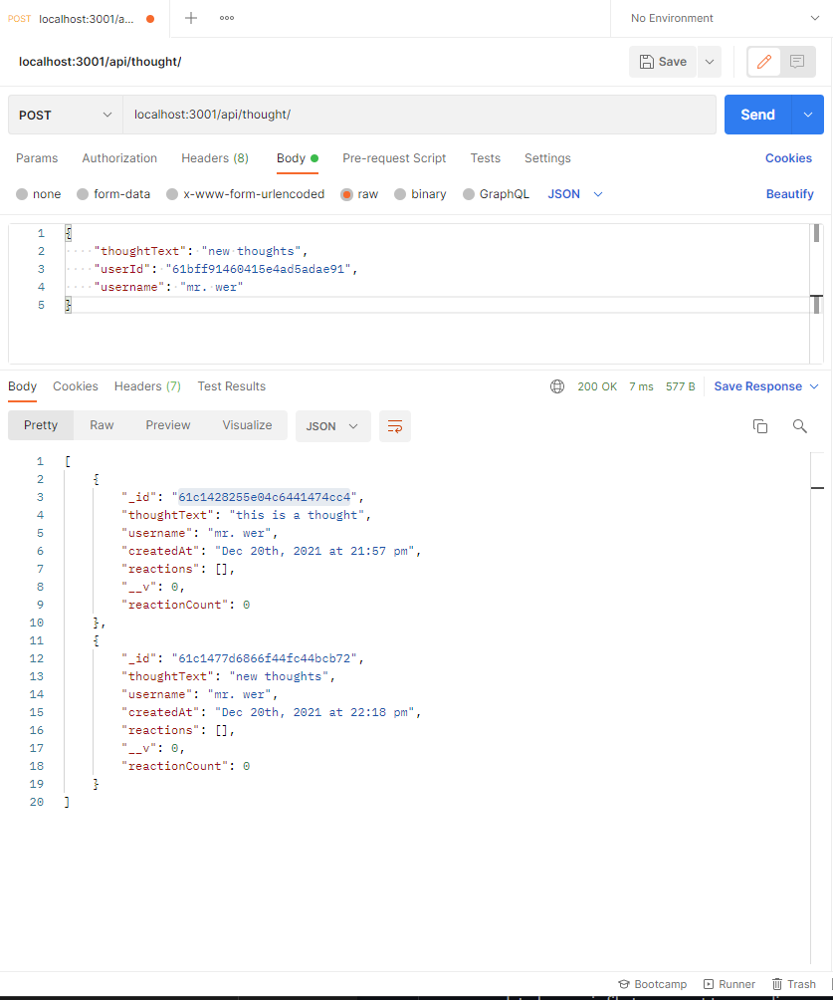

# 18 NoSQL: Social Network API

Your challenge is to build an API for a social network using Express.js for routing, a MongoDB database, and the Mongoose ODM. In addition to using the [Express](https://www.npmjs.com/package/express) and [Mongoose](https://www.npmjs.com/package/mongoose) packages, you may also optionally use a JavaScript date library of your choice or the native JavaScript `Date` object to format timestamps.

## Steps

* Created the base server file and installed express and mongoose
* created the folder layout (Assets, models, controllers, routes and utils) with empty js files
* wrote the model schemas
* wrote the controllers to operate the CRUD
* created the routes
* created the dateFormat file
* tested the functionality of all the controllers and made sure each route worked properly

## ScreenShots

## Links

GitHub repository: https://github.com/ToiletTakos/soical-network-api

walkthrough video pt1: https://watch.screencastify.com/v/3vJFw0JLlmkVu9ZUTl4Y

walkthrough pt 2: https://watch.screencastify.com/v/wQRVRoNYHbgEpy2eCk9Q

